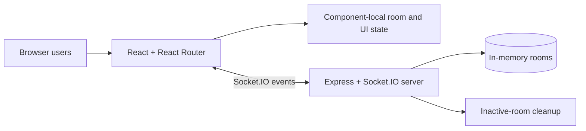

<p align="center">
  
</p>

<h1 align="center">Planning Poker</h1>

<p align="center">
  <strong>Real-time team estimation</strong><br>
  <em>Estimate. Discuss. Align.</em>
</p>

<p align="center">
  <a href="docs/releases/release-0.1-repository-foundation/README.md"></a>
  <a href="docs/releases/release-0.2-experience-foundation/README.md"></a>
  
  
  
  <a href="LICENSE"></a>
</p>

**Planning Poker** is a small React, Tailwind CSS, Express, and Socket.IO application for collaborative estimation sessions. A moderator creates a room, teammates join through a shared room link, everyone votes privately, and the result can be revealed and discussed in real time.

[User guide](docs/user-guide.md) · [Architecture](docs/architecture.md) · [Screenshot gallery](docs/screenshots/README.md) · [Release plan](docs/releases/README.md) · [All documentation](docs/README.md)

## Highlights

- Real-time room updates over Socket.IO.
- Scrum, Fibonacci, T-shirt-size, and day-based value sets.
- Private voting until automatic or moderator-controlled reveal.
- Vote distribution plus numeric average, minimum, maximum, and consensus.
- Moderator controls for reset, reveal, participant removal, and delegation.
- In-memory rooms with no account, database, analytics, or tracking dependency.

## Screenshot

[](docs/screenshots/README.md)

The checked image is the current desktop baseline. Release 0.2 plans deterministic desktop and mobile captures with invented fixture data; see [PP-009](docs/releases/release-0.2-experience-foundation/stories/PP-009-privacy-safe-screenshot-workflow.md).

## Architecture



The server is authoritative for room membership, moderation, votes, reveal state, and value-set selection. The browser renders the latest `room-updated` snapshot and keeps only a short-lived participant token in `sessionStorage` for reconnect fallback. There is no database, account service, or durable room history. Read the [architecture guide](docs/architecture.md) before changing event names or room lifecycle behavior.

## Quick start

### Prerequisites

- Node.js `22.13+`
- Corepack (included with the supported Node.js release)

### Install and run both applications

```bash
git clone https://github.com/kereszteszsolt/example-planning-poker-react-express-socket-io.git
cd example-planning-poker-react-express-socket-io

corepack enable
pnpm install --frozen-lockfile
pnpm dev
```

Open `http://localhost:5173`. The Socket.IO server listens on `http://localhost:3000`.

The safe local defaults work without environment variables. Backend host, port, allowed origins, limits, cleanup/recovery timing, the frontend Socket.IO URL, local proxy target, and deployment base path can be configured as documented in the [development guide](docs/development.md#runtime-configuration). Production requires an explicit non-wildcard origin allowlist.

### Build verification

```bash
pnpm lint
pnpm typecheck
pnpm test
pnpm build
```

See [testing and verification](docs/testing.md) for the manual room matrix and current automation gaps.

## Documentation and releases

- [Documentation index](docs/README.md)
- [User guide](docs/user-guide.md)
- [Architecture and event flows](docs/architecture.md)
- [Development guide](docs/development.md)
- [Testing and verification](docs/testing.md)
- [Package verification report](docs/verification.md)
- [Brand configuration](docs/brand-configuration.md)
- [Design-system and token plan](docs/design-system.md)
- [Penpot handoff plan](docs/design/README.md)
- [Screenshot gallery and capture policy](docs/screenshots/README.md)
- [Privacy and contact boundaries](docs/privacy-and-contact.md)
- [Release index](docs/releases/README.md)
- [Release 0.1: Repository foundation](docs/releases/release-0.1-repository-foundation/README.md)
- [Release 0.2: Experience foundation](docs/releases/release-0.2-experience-foundation/README.md) — planned

## Project identity

| Property | Canonical value |
| --- | --- |
| Product | `Planning Poker` |
| Descriptor | `Real-time team estimation` |
| Tagline | `Estimate. Discuss. Align.` |
| Repository | `example-planning-poker-react-express-socket-io` |
| Frontend package | `@planning-poker/web` (`apps/web`) |
| Backend package | `@planning-poker/server` (`apps/server`) |
| Shared contracts | `@planning-poker/contracts` (`packages/contracts`) |
| Package manager | `pnpm@11.23.0` via Corepack |
| Story prefix | `PP-` |
| Maintainer | Keresztes Zsolt — [kereszteszsolt.hu](https://kereszteszsolt.hu/) |

The product name remains intentionally descriptive. A future repository rename should update clone URLs, support links, deployment configuration, badges, and documentation in the same change.

## Privacy and deployment boundary

Rooms and votes exist only in the server process memory. They disappear when the process restarts, when the disconnect path removes the last participant, or when the inactivity cleanup expires the room. A room link acts as the only access boundary; do not use the current application for confidential story titles, customer data, credentials, or regulated information.

Transport encryption depends on deployment. Local development uses plain HTTP. A public deployment should terminate HTTPS/WSS at a trusted reverse proxy and set `PP_ALLOWED_ORIGINS` to the exact frontend origins; production startup rejects a missing or wildcard allowlist.

## Support and contact

**Project maintainer: Keresztes Zsolt**

| Platform | Link |
| --- | --- |
| Website | [kereszteszsolt.hu](https://kereszteszsolt.hu/) |
| GitHub | [@kereszteszsolt](https://github.com/kereszteszsolt) |
| User guide | [Planning Poker user guide](docs/user-guide.md) |

> The maintainer's website is available in Hungarian (HU), English (EN), Romanian (RO), and German (DE).

## License

Apache License 2.0. See [`LICENSE`](LICENSE).

## ☕ Ways to support

**Explore ways to support the maintainer and their projects.**

[kereszteszsolt.hu/ways-to-support](https://kereszteszsolt.hu/ways-to-support/)

<p align="center">
  <a href="https://buymeacoffee.com/kereszteszsolt"></a><br>
  <strong>Every coffee counts! ☕❤️</strong>
</p>

## Made with love

<p align="center">
  <strong>Made with ❤️ by <a href="https://kereszteszsolt.hu/">Keresztes Zsolt</a></strong><br>
  ⭐ Star this repository if it helped your team estimate more clearly.
</p>
