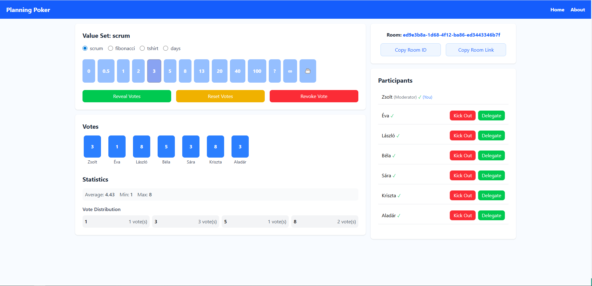

# Planning Poker — React + MUI + Express + Socket.IO

A simple Planning Poker example app built with React, Material UI (MUI), Express.js and Socket.IO for **real-time**
estimation sessions.

## Features

* Real-time collaboration using Socket.IO
* Four built-in value sets: **Fibonacci**, **T-shirt sizes**, **Scrum**, **Days**
* Copy room link or room ID to share with teammates
* Statistics (mean, median, min, max) for numerical value sets
* Vote distribution visualization for any value set
* Clear votes and revoke votes
* Show participants who haven't voted yet
* Kick out participants
* Delegate moderator role and take moderator role when moderator disconnects or is missing
* Auto-reconnect on connection loss
* The first user to join a room becomes the moderator
* Auto-close room after all participants leave or after 1 hour of inactivity

## Screenshots

npm run dev-concurrently (in the planning-poker-be folder) – this will run both the frontend and the backend
simultaneously.  
Open in your browser: http://localhost:5173

Linktree:  
https://linktr.ee/kereszteszsolt

Found this helpful? You can support me on BuyMeACoffee. Contributions are optional and are simply a way to show appreciation for this work, not a payment for services.

