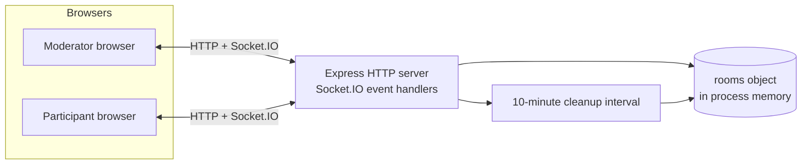
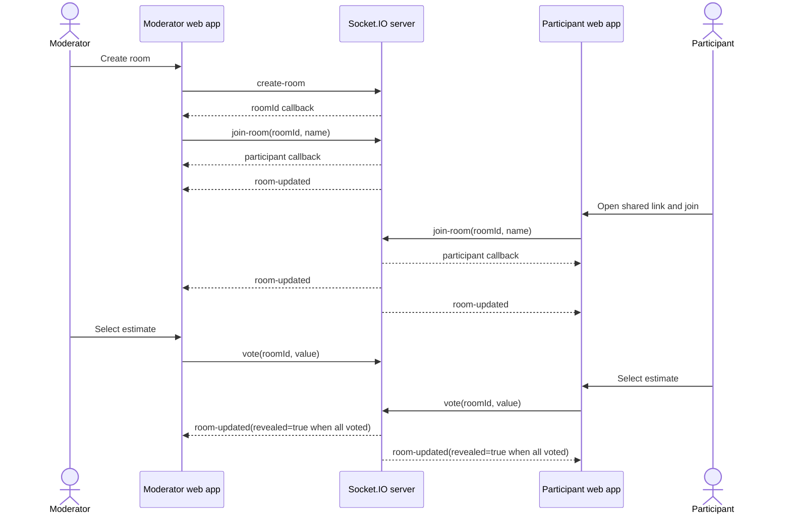
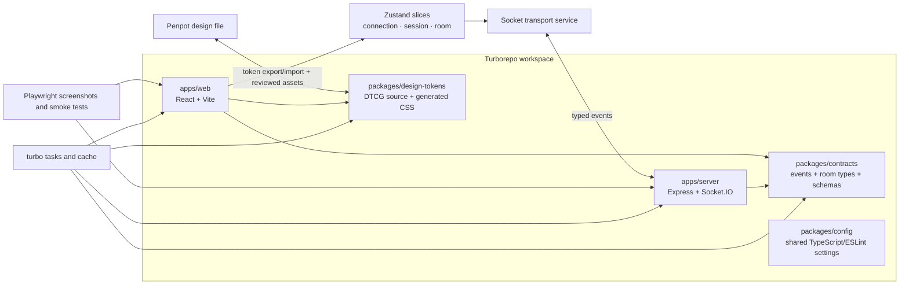

# Planning Poker architecture

## System purpose

Planning Poker coordinates a short-lived estimation room. The browser owns presentation and transient form state; the Socket.IO server owns the canonical room snapshot. All room data is held in one Node.js process and is intentionally non-durable.

## Current system context



### Runtime boundaries

| Boundary | Current responsibility |
| --- | --- |
| React Router | Home, room, message, and about routes |
| `SocketProvider` | Constructs the Socket.IO client and exposes it through React context |
| `HomeScreen` | Creates rooms, accepts room IDs, and reports connection state |
| `RoomScreen` | Joins a room, subscribes to room events, derives the current participant, and wires all room actions |
| Room components | Voting cards, controls, participants, results, statistics, and room sharing |
| Socket.IO server | Validates a limited set of actions, mutates room state, and broadcasts full snapshots |
| `rooms` object | In-memory room lookup keyed by room ID |
| Cleanup interval | Deletes rooms inactive for more than one hour |

The current client has no global application store. Most room and connection state lives in `RoomScreen`; join input and other small concerns stay in local component state.

## Current room model

```text
Room
├── id: string
├── valueSet: "scrum" | "fibonacci" | "tshirt" | "days"
├── participants: Record<socketId, Participant>
├── revealed: boolean
└── lastUpdated?: number

Participant
├── id: socketId
├── name: string
├── voted: boolean
├── vote?: number | string
└── isModerator: boolean
```

The socket ID is currently both transport identity and participant identity. That makes reconnection behavior fragile because a new unrecovered Socket.IO session may receive a new ID.

## Event contract

| Client event | Payload | Server effect | Authorization |
| --- | --- | --- | --- |
| `create-room` | empty object | Creates a UUID room with the Scrum value set | Any connected socket |
| `join-room` | `roomId`, `name` | Creates missing room, rejects duplicate name, adds participant | Any connected socket |
| `vote` | `roomId`, `vote` | Stores vote and reveals automatically when everyone voted | Room participant |
| `revoke` | `roomId` | Deletes caller's vote and hides results | Room participant |
| `reveal` | `roomId` | Reveals current votes | Moderator |
| `reset` | `roomId` | Clears every vote and hides results | Moderator |
| `change-value-set` | `roomId`, `valueSet` | Changes set and clears votes | Moderator |
| `kick-out` | `roomId`, `participantId` | Removes participant record and emits `kicked-out` | Moderator |
| `delegate` | `roomId`, `participantId` | Transfers moderator flag | Moderator |
| `take-over` | `roomId` | Claims moderation when no moderator exists | Room participant |
| `leave-room` | `roomId` | Removes caller from the participant record | Room participant |

The server broadcasts `room-updated` with the complete room snapshot after successful mutations. It also emits `room-closed` after inactivity and `kicked-out` to a removed participant.

## Core interaction sequence



## Current lifecycle findings

The supplied implementation is intentionally small, but the following findings should be treated as product defects or hardening work rather than documentation-only concerns:

1. `SocketProvider` creates a client during render and does not own an explicit disconnect cleanup. React rerenders or Strict Mode can therefore produce avoidable connection churn.
2. The reconnect listener in `RoomScreen` closes over state that is not part of the effect dependency list, so the intended automatic rejoin can miss the current participant.
3. Participant identity is the ephemeral socket ID, while the server does not enable Socket.IO connection-state recovery or maintain a separate session token.
4. `join-room` accepts arbitrary room IDs and creates a room when none exists. It has no UUID, name-length, or payload-shape validation. A plain object is used as the room map.
5. `leave-room` removes the participant but does not delete an empty room. The README must therefore not claim that every explicit last leave immediately closes the room.
6. `kick-out` deletes the participant record but does not force the socket to leave the Socket.IO room, because that line is currently commented out.
7. CORS accepts every origin and both frontend and server endpoints are hardcoded for localhost.
8. The About page says Markdown-style `**text**` inside JSX and makes an absolute no-encryption statement that is inaccurate for HTTPS/WSS deployments.
9. The join card has a fixed `657px` width, which can overflow narrow screens.
10. The original README claimed Material UI and median statistics, neither of which exists in the supplied code.

These items are converted into acceptance criteria in [PP-004](releases/release-0.2-experience-foundation/stories/PP-004-runtime-and-room-lifecycle-hardening.md), [PP-007](releases/release-0.2-experience-foundation/stories/PP-007-design-tokens-and-ui-polish.md), and [PP-010](releases/release-0.2-experience-foundation/stories/PP-010-test-and-ci-foundation.md).

## Planned Release 0.2 target



### Target boundaries

- **Turborepo** orchestrates `dev`, `lint`, `typecheck`, `test`, `build`, and `screenshots`; it does not change runtime behavior by itself.
- **Shared contracts** define event payloads, acknowledgements, room types, and validation schemas once for both applications.
- **Zustand** owns serializable connection, session, and room state. The live Socket.IO instance stays in a transport service and is never persisted.
- **Design tokens** are the shared language between Penpot and code. Global, semantic, and component tokens are separated.
- **Penpot** documents current screens, target responsive behavior, reusable components, states, and the agreed token hierarchy.
- **Playwright** captures invented, deterministic room states and validates critical desktop/mobile flows in a pinned environment.

## Non-goals for Release 0.2

Release 0.2 does not require accounts, a database, durable history, public multi-tenant hosting, Redis adapters, horizontal scaling, or rewriting Express/Socket.IO. Those changes need separate product and threat-model decisions.
