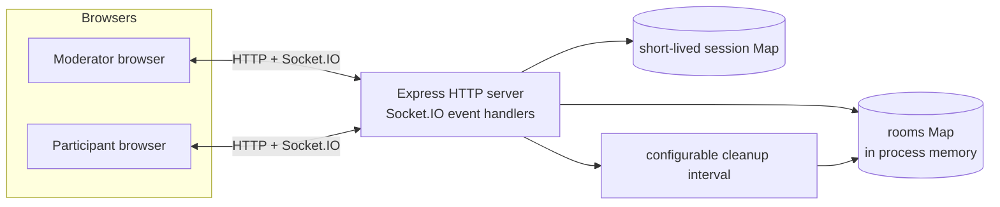
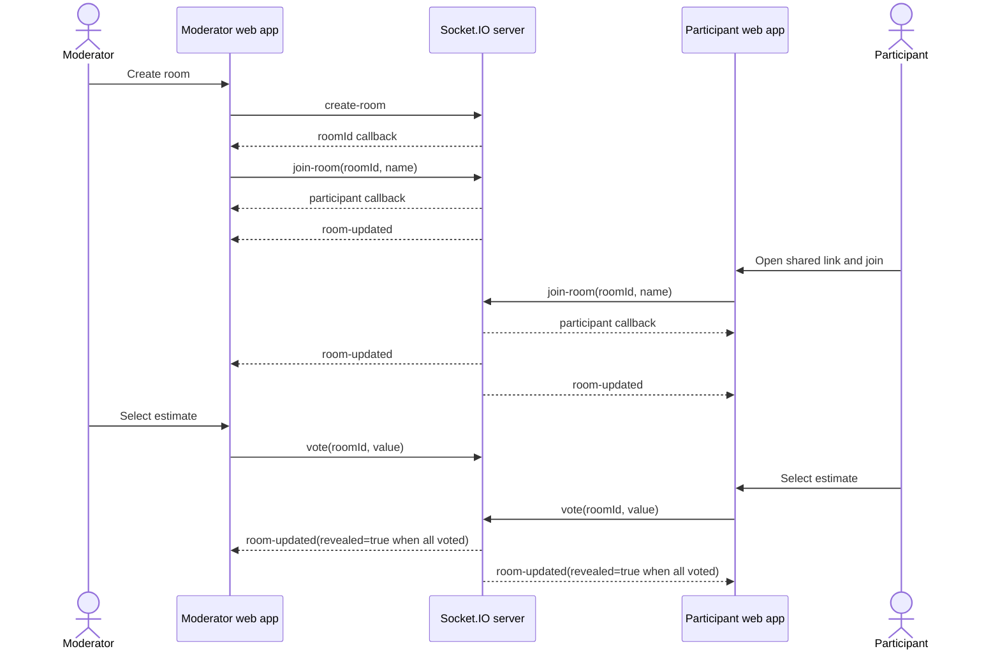
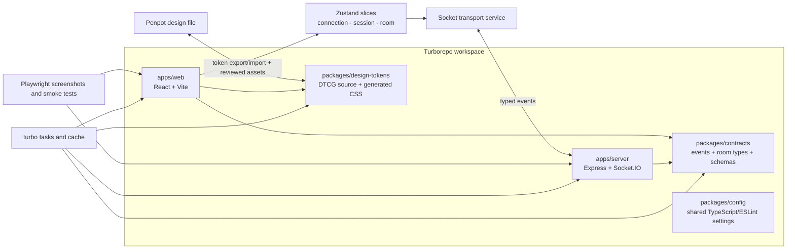

# Planning Poker architecture

## System purpose

Planning Poker coordinates a short-lived estimation room. The browser owns presentation and transient form state; the Socket.IO server owns the canonical room snapshot. All room data is held in one Node.js process and is intentionally non-durable.

## Current system context



### Runtime boundaries

| Boundary | Current responsibility |
| --- | --- |
| React Router | Home, room, message, and about routes |
| `socket-client` | Owns the single Socket.IO client and environment-selected endpoint |
| `SocketProvider` | Injects the singleton socket into the transport adapter and owns adapter startup/final cleanup |
| Zustand store | Holds serializable connection, session, canonical room, normalized error, and forced-exit state; actions are kept outside the stored data |
| Socket transport | Registers typed listeners once, normalizes acknowledgements, resumes sessions, and dispatches pure state transitions |
| `HomeScreen` | Creates rooms, accepts room IDs, and reads connection/error selectors while retaining its input locally |
| `RoomScreen` | Activates the route room, reacts to connection/exit selectors, and composes selector-driven room panels |
| Room components | Voting cards, controls, participants, results, statistics, and room sharing |
| Socket.IO server | Validates every action, acknowledges success/error, mutates authoritative state, and broadcasts full snapshots |
| `rooms` Map | UUID-keyed in-memory room lookup immune to special object keys |
| `sessions` Map | Short-lived token-to-participant recovery records; never exposed in room snapshots |
| Cleanup interval | Emits closure, removes expired rooms/sessions, and can use an injected clock in tests |

The client has one provider-scoped Zustand store composed from connection, session, room, and limited UI slices. Store data is serializable and changed through a pure reducer. The live Socket.IO object, subscriptions, storage calls, and network exceptions stay in the transport adapter. Join/room-ID inputs, clipboard feedback, and other one-component concerns remain local React state.

## Current room model

```text
Public Room snapshot
├── id: string
├── valueSet: "scrum" | "fibonacci" | "tshirt" | "days"
├── participants: Record<participantUuid, Participant>
├── revealed: boolean
└── lastUpdated: number

Participant
├── id: stable participant UUID
├── name: string
├── voted: boolean
├── vote?: number | string
└── isModerator: boolean
```

Internal participant records additionally contain the current socket ID, an unguessable short-lived session token, and join order. The token is returned only to its participant and stored in browser `sessionStorage`; it is not included in `room-updated`. A recovered or fallback connection binds a new socket ID to the stable participant UUID and always receives a fresh canonical snapshot.

## Event contract

| Client event | Payload | Server effect | Authorization |
| --- | --- | --- | --- |
| `create-room` | empty object | Creates a UUID room with the Scrum value set | Any connected socket |
| `join-room` | `roomId`, `name`, optional `sessionToken` | Joins an existing room or resumes a valid short-lived session | Any connected socket |
| `vote` | `roomId`, `vote` | Stores vote and reveals automatically when everyone voted | Room participant |
| `revoke` | `roomId` | Deletes caller's vote and hides results | Room participant |
| `reveal` | `roomId` | Reveals current votes | Moderator |
| `reset` | `roomId` | Clears every vote and hides results | Moderator |
| `change-value-set` | `roomId`, `valueSet` | Changes set and clears votes | Moderator |
| `kick-out` | `roomId`, `participantId` | Removes participant record and emits `kicked-out` | Moderator |
| `delegate` | `roomId`, `participantId` | Transfers moderator flag | Moderator |
| `take-over` | `roomId` | Defensive fallback only when no moderator exists | Room participant |
| `leave-room` | `roomId` | Removes caller from the participant record | Room participant |

Every client event receives `{ ok: true, data }` or `{ ok: false, error: { code, message, recoverable } }`. The server broadcasts `room-updated` only after successful mutations. It emits `room-closed` before inactivity teardown, `kicked-out` before forcing a removed socket to leave, and `session-replaced` when the same token moves to another connection.

## Core interaction sequence



## Current lifecycle rules

1. Only `create-room` creates rooms; join validates the UUID and returns `ROOM_NOT_FOUND` for unknown or expired rooms.
2. Display names are trimmed, 2-40 characters, control-character free, and duplicate-compared after Unicode normalization and case folding.
3. Explicit leave, kick, and disconnect remove both application membership and Socket.IO room membership. An empty room is deleted immediately.
4. Moderator departure transfers deterministically to the longest-present eligible participant, and each emitted snapshot has at most one moderator.
5. Disconnect retains a short-lived recovery record only while the room remains alive. Rejoin restores the stable identity and compatible vote, then applies the latest room snapshot.
6. Environment variables control endpoints, origins, participant/payload limits, recovery, and cleanup. Production refuses missing or wildcard origins.
7. Numeric statistics exclude special cards while the distribution includes them; clipboard feedback is non-blocking and room links honor the Vite base path.

Focused PP-004 server and React tests protect these rules. PP-005 places the client and server in one Turborepo workspace and makes `@planning-poker/contracts` the shared source for room models, events, acknowledgements, public errors, value sets, and runtime validation schemas without changing event semantics.

## Release 0.2 workspace and current boundaries



### Current and planned boundaries

- **Turborepo** currently orchestrates `dev`, `lint`, `typecheck`, `test`, `build`, and the reserved `screenshots` task; it does not change runtime behavior by itself.
- **Shared contracts** currently define event payloads, acknowledgements, room types, public errors, value sets, and Zod validation schemas once for both applications.
- **Zustand** owns serializable connection, session, room, normalized error, and forced-exit state. The live Socket.IO instance stays in an injected transport service and is never persisted. No Redux DevTools or persistence middleware is enabled.
- **Design tokens** are the shared language between Penpot and code. Global, semantic, and component tokens are separated.
- **Penpot** documents current screens, target responsive behavior, reusable components, states, and the agreed token hierarchy.
- **Playwright** captures invented, deterministic room states and validates critical desktop/mobile flows in a pinned environment.

## Non-goals for Release 0.2

Release 0.2 does not require accounts, a database, durable history, public multi-tenant hosting, Redis adapters, horizontal scaling, or rewriting Express/Socket.IO. Those changes need separate product and threat-model decisions.
