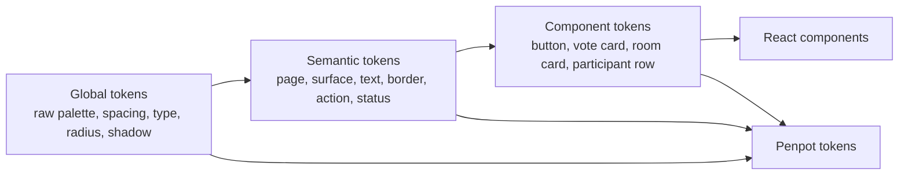

# Planning Poker design-system plan

## Current visual baseline

The current interface uses Tailwind CSS utility classes directly in JSX. Blue is used for primary actions and voting cards, green for reveal/delegation/success, yellow for reset, red for revoke/removal, white cards on a pale page background, and gray text/borders for secondary information.

This is sufficient for a small demo but has no shared semantic token contract. Similar values are repeated across components, disabled and error behavior is inconsistent, and several layout choices are fixed rather than responsive.

## Release 0.2 goal

Introduce a small design system that improves consistency and accessibility without turning the project into a component-library rewrite. Penpot and the application must consume the same named decisions, with code remaining the source of truth for shipped behavior and the design file remaining the source of truth for reviewed visual intent.

## Token hierarchy



### Tier 1: global

Examples:

- `color.base.blue.600`
- `color.base.gray.950`
- `spacing.base.4`
- `radius.base.lg`
- `shadow.base.card`
- `font.size.body`

### Tier 2: semantic

Examples:

- `color.bg.page`
- `color.bg.surface`
- `color.text.primary`
- `color.text.muted`
- `color.border.default`
- `color.action.primary`
- `color.status.danger`
- `space.layout.section`

### Tier 3: component

Examples:

- `color.button.primary.bg`
- `color.button.primary.bgHover`
- `color.voteCard.selected.bg`
- `color.voteCard.hidden.bg`
- `radius.roomPanel`
- `shadow.roomPanel`

The repository includes [`design/planning-poker.tokens.draft.json`](design/planning-poker.tokens.draft.json) as a non-runtime DTCG draft. It exists to make naming and Penpot discussion concrete. Release 0.2 must review it, place the approved source in a workspace package, generate CSS variables, and verify imports before calling tokens implemented.

## Proposed CSS contract

```css
:root {
  --pp-color-bg-page: #f8fbff;
  --pp-color-bg-surface: #ffffff;
  --pp-color-text-primary: #111827;
  --pp-color-text-muted: #4b5563;
  --pp-color-action-primary: #2563eb;
  --pp-color-action-primary-hover: #1d4ed8;
  --pp-color-status-success: #16a34a;
  --pp-color-status-warning: #d97706;
  --pp-color-status-danger: #dc2626;
  --pp-radius-panel: 0.75rem;
  --pp-shadow-panel: 0 10px 30px rgb(15 23 42 / 0.08);
}
```

Tailwind utilities may still be used, but component styles should resolve through semantic CSS variables or a generated theme mapping. Arbitrary one-off colors should require an explicit design review.

## Focused UI polish scope

Release 0.2 should improve the existing product rather than redesign its purpose:

- Replace the fixed-width join panel with a fluid, max-width layout.
- Establish a responsive room grid that stacks cleanly on mobile and allows long participant lists to scroll.
- Strengthen visual hierarchy between room identity, voting, results, and moderation.
- Replace blocking `alert()` calls with non-blocking, accessible feedback.
- Add visible focus styles, form labels, live connection status, and clear disabled states.
- Give selected, voted, hidden, revealed, disconnected, kicked, and closed states distinct non-color cues.
- Correct About-page formatting and deployment-security wording.
- Keep all four value sets and current moderation workflows recognizable.

## Penpot component inventory

The first Penpot library should contain only components required by current behavior:

- App header and navigation.
- Primary, secondary, warning, danger, and quiet buttons.
- Text field with label, hint, error, and disabled variants.
- Voting card with default, hover, focus, selected, disabled, and revealed variants.
- Room panel and section heading.
- Participant row with moderator, self, voted, and action states.
- Connection/status banner.
- Toast or inline copy feedback.
- Vote distribution item.

## Accessibility acceptance boundary

- Keyboard users can reach and operate every action in a logical order.
- Focus indicators remain visible on every interactive element.
- Text and essential controls meet WCAG AA contrast targets.
- Status changes are announced without moving focus unexpectedly.
- Touch targets remain usable on small screens.
- Motion is minimal and honors reduced-motion preferences.
- Meaning is not conveyed by color alone.

See [PP-007](releases/release-0.2-experience-foundation/stories/PP-007-design-tokens-and-ui-polish.md) for testable acceptance criteria.
