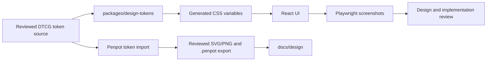

# Planning Poker Penpot handoff

## Included repository assets

| Asset | Purpose | Status |
| --- | --- | --- |
| [`planning-poker-interface-plan.svg`](planning-poker-interface-plan.svg) | Portable vector board for current flow, target workspace, mobile hierarchy, token tiers, and design principles | Included and reviewable |
| [`planning-poker-interface-plan.png`](planning-poker-interface-plan.png) | Rendered preview of the vector board | Included after local render |
| [`planning-poker.tokens.draft.json`](planning-poker.tokens.draft.json) | DTCG-style naming draft for Penpot/code discussion | Documentation draft, not runtime source |

No connected Penpot project or `.penpot` export was created as part of this package. Release 0.2 must not mark Penpot synchronization complete until a real file is created, exported, committed, and verified.

## Proposed Penpot file structure

```text
Planning Poker
├── 00 · Foundations
│   ├── Token overview
│   ├── Typography and spacing
│   └── Accessibility notes
├── 01 · Components
│   ├── Buttons and fields
│   ├── Voting cards
│   ├── Panels and status banners
│   └── Participant rows and result items
├── 02 · Core flow
│   ├── Home
│   ├── Join room
│   ├── Vote hidden
│   └── Reveal and reset
├── 03 · Moderation and recovery
│   ├── Delegate and remove
│   ├── Moderator disconnected
│   ├── Reconnect success/failure
│   └── Room closed / participant removed
└── 04 · Responsive review
    ├── Desktop workspace
    ├── Tablet stack
    └── Mobile flow
```

Boards should be organized by functional area, with a clear entry point and left-to-right flow from wireframe through reviewed design. Avoid one unstructured infinite canvas.

## Token synchronization contract



- The approved DTCG JSON must have one canonical repository location.
- Penpot aliases and application CSS variables must preserve semantic meaning even if their platform syntax differs.
- The application must not consume PNG exports as a substitute for real components.
- A token rename requires a migration plan across JSON, CSS variables, Penpot references, tests, and documentation.

## Initial screen requirements

### Home and join

- Clear product purpose and one primary create action.
- Labeled room-ID and display-name inputs.
- Connected, connecting, unavailable, and validation states.
- Responsive card width with no horizontal overflow.

### Room workspace

- Room identity and sharing controls are secondary to voting.
- Current value set and voting cards remain the dominant action area.
- Participant status is legible without revealing values.
- Moderator-only actions are grouped and clearly distinguished from personal revoke behavior.
- Results transition does not cause disruptive layout movement.

### Mobile hierarchy

1. Connection/room status.
2. Value set and cards.
3. Personal and moderator vote controls.
4. Votes and statistics.
5. Participants and room sharing.

The exact order may change after usability review, but every current action must remain reachable.

## Handoff completion checklist

- [ ] Penpot file and page identifiers are recorded.
- [ ] Tokens are imported from the approved repository source.
- [ ] Component names and variants match the design-system documentation.
- [ ] Desktop, tablet, and mobile core flows are reviewed.
- [ ] Error, disabled, focus, loading, disconnected, kicked, and closed states are present.
- [ ] Fresh `.penpot`, SVG, and PNG exports are committed.
- [ ] Exported images contain invented data only.
- [ ] Implementation screenshots are compared against the intended hierarchy.
- [ ] [PP-008](../releases/release-0.2-experience-foundation/stories/PP-008-penpot-design-handoff.md) contains identifiers and verification evidence.
