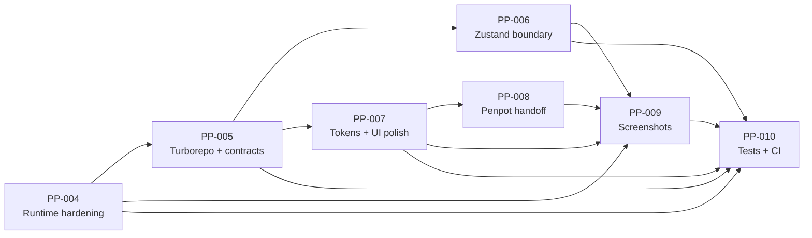

# Release 0.2: Experience foundation

## Status

Planned

## Goal

Make the existing Planning Poker experience dependable, maintainable, responsive, and reviewable while preserving its simple in-memory, no-account product model.

## Outcomes

- Critical local runtime, room lifecycle, validation, reconnection, removal, and moderator defects are fixed.
- The repository becomes one npm workspace orchestrated by Turborepo, with shared event contracts.
- Shared browser state moves to a deliberate Zustand boundary without persisting sensitive room data.
- A compact design-token package drives a modest, accessible UI polish.
- A real Penpot file documents foundations, components, responsive flows, and edge states.
- Playwright produces privacy-safe deterministic screenshots and smoke evidence.
- Automated frontend, server, integration, and CI checks protect the new boundaries.

## Story map

| Story | Focus | Status |
| --- | --- | --- |
| [PP-004](stories/PP-004-runtime-and-room-lifecycle-hardening.md) | Runtime configuration, validation, reconnect, lifecycle, moderation, and current defects | Planned |
| [PP-005](stories/PP-005-turborepo-workspace-and-shared-contracts.md) | npm workspaces, Turborepo, one lockfile, shared events/types/schemas | Planned |
| [PP-006](stories/PP-006-zustand-room-state-boundary.md) | Connection/session/room store slices and transport lifecycle | Planned |
| [PP-007](stories/PP-007-design-tokens-and-ui-polish.md) | DTCG tokens, generated CSS, responsive and accessible UI refinement | Planned |
| [PP-008](stories/PP-008-penpot-design-handoff.md) | Real Penpot file, components, states, responsive boards, exports | Planned |
| [PP-009](stories/PP-009-privacy-safe-screenshot-workflow.md) | Deterministic Playwright captures and documentation gallery | Planned |
| [PP-010](stories/PP-010-test-and-ci-foundation.md) | Unit, integration, E2E, accessibility, CI, and release evidence | Planned |

## Dependency flow

The order is directional, not a reason to postpone regression tests. PP-004 must add focused tests for each lifecycle fix; PP-010 consolidates the full root-level quality gate after the workspace migration.

## Delivery phases

### Phase A: Stabilize behavior

Implement PP-004 with focused server/client tests. Freeze event semantics before moving directories.

### Phase B: Establish repository boundaries

Implement PP-005 and verify that runtime behavior remains unchanged under root workspace commands.

### Phase C: Improve state and presentation

Implement PP-006 and PP-007 in reviewable increments. Avoid one large UI/state rewrite.

### Phase D: Synchronize design and evidence

Implement PP-008 and PP-009 using the approved token source and deterministic test data.

### Phase E: Release gate

Complete PP-010, update all story evidence, run the full root pipeline on a clean checkout, and publish reviewed release notes.

## Release exit criteria

- [ ] A clean checkout installs with one root `npm ci` and one lockfile.
- [ ] Root `dev`, `lint`, `typecheck`, `test`, `build`, and `screenshots` commands are documented and pass.
- [ ] No known duplicate socket creation, stale reconnect closure, ghost kicked participant, empty-room leak, arbitrary room-key, or fixed-width join defect remains.
- [ ] Recoverable and unrecoverable reconnects have explicit, tested UI behavior.
- [ ] Event payloads and acknowledgements are shared and runtime-validated.
- [ ] Zustand contains serializable state only and resets safely on leave, kick, close, and unrecoverable session loss.
- [ ] Approved DTCG tokens generate application variables and are imported into Penpot.
- [ ] Core screens and edge states are reviewed at desktop, tablet, and mobile widths.
- [ ] Fresh Penpot backup/export assets and deterministic screenshots are committed.
- [ ] CI runs the same root commands documented for developers.
- [ ] README, user guide, architecture, testing, design, screenshot gallery, changelog, and support documentation match the implemented release.

## Explicit non-goals

- User accounts, login, invitations, or role directories.
- Persistent rooms, estimation history, backlog integration, or audit trails.
- Redis, multi-process adapters, horizontal scaling, or high availability.
- Public SaaS deployment or claims of production security certification.
- Replacing React, Express, Socket.IO, Vite, or Tailwind CSS.
- A broad visual rebrand unrelated to usability, accessibility, and consistency.
