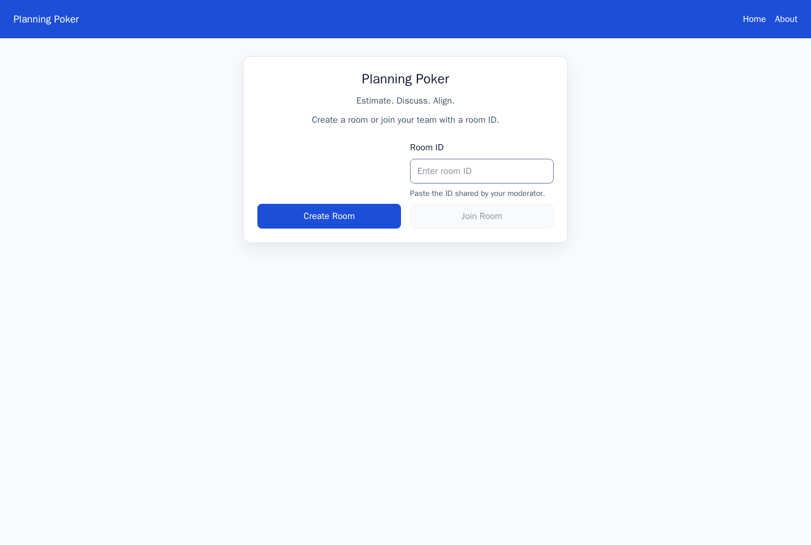
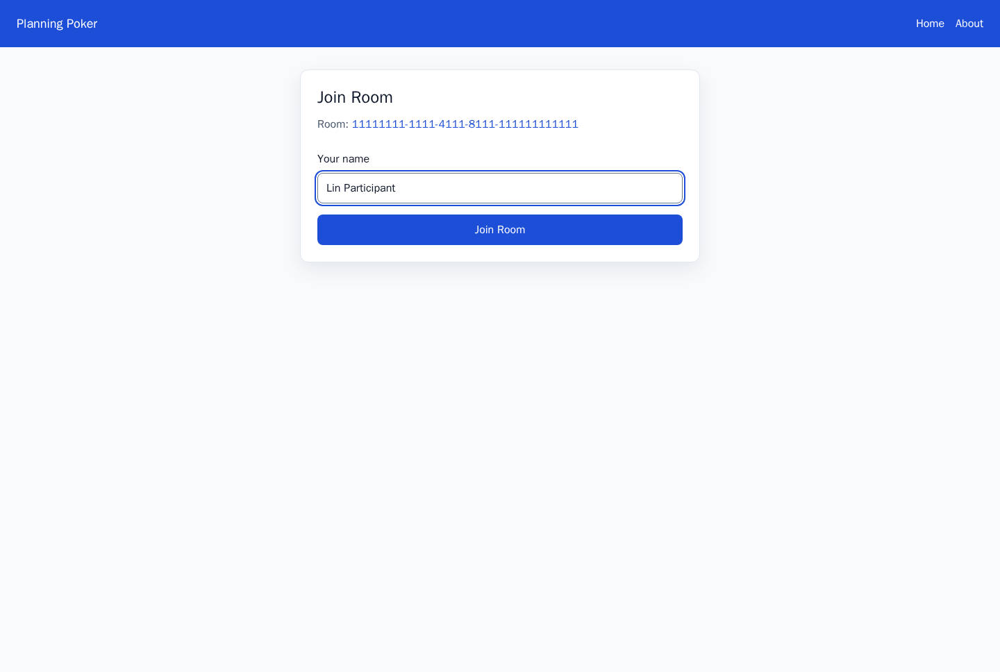
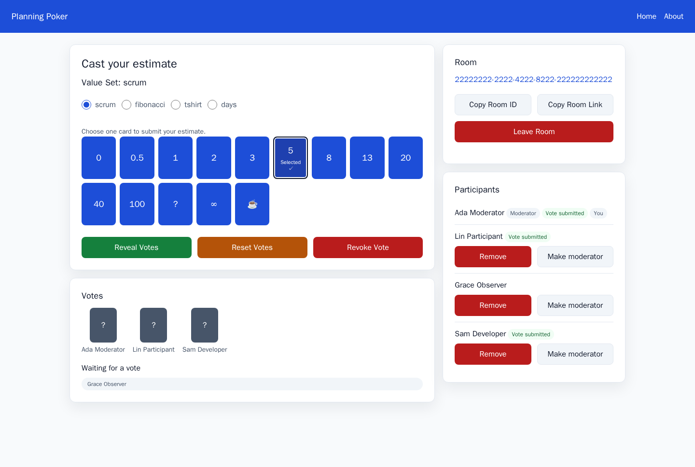
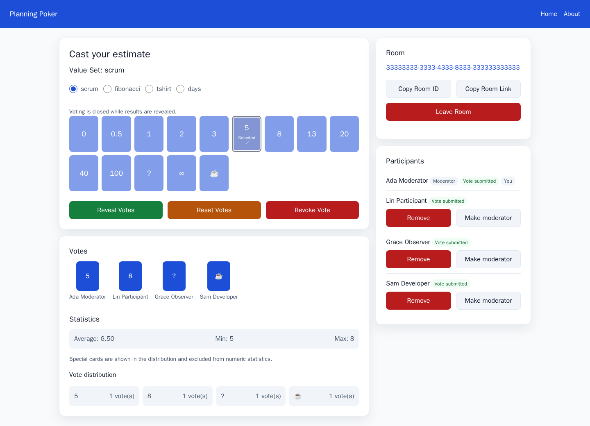
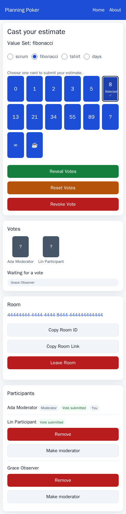
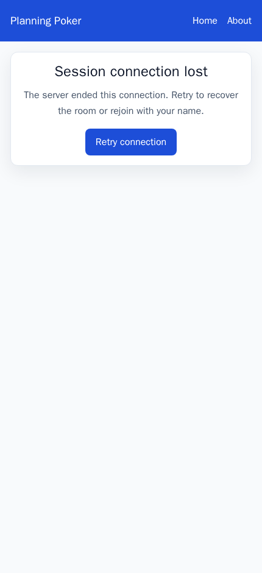

# Planning Poker screenshots

## Current gallery

All six images are generated by the PP-009 Playwright workflow and double as reviewed visual-comparison baselines.

### Connected home — desktop



### Join flow — desktop



### Hidden voting — desktop



### Revealed results — desktop



### Voting workflow — mobile



### Connection loss — mobile



## Privacy boundary

Every checked screenshot must:

- use invented participant names, room IDs, estimates, and status text;
- avoid a maintainer's live browser profile, clipboard contents, production room, or private team data;
- hide or replace dynamic timestamps, random IDs, and other unstable values when they are not part of the scenario;
- be visually inspected before commit;
- state whether it was manually captured or generated by the repository workflow.

## Release 0.2 capture matrix

| File | Viewport | Full-page output | State |
| --- | --- | --- | --- |
| `planning-poker-home-desktop.png` | 1440×960 | 1440×968 | Connected home with create/join choices |
| `planning-poker-join-desktop.png` | 1440×960 | 1440×968 | Labeled join form with visible keyboard focus |
| `planning-poker-room-voting-desktop.png` | 1440×960 | 1440×968 | Multiple participants, hidden votes, moderator controls |
| `planning-poker-room-results-desktop.png` | 1440×960 | 1440×1040 | Revealed numeric and special-card distribution |
| `planning-poker-room-mobile.png` | 430×932 | 430×1754 | Full stacked responsive room workflow |
| `planning-poker-disconnected-mobile.png` | 430×932 | 430×940 | Actionable connection-loss and retry state |

## Fixture and isolation architecture

The dev-only [`@planning-poker/screenshots`](../../apps/screenshots/package.json) workspace serves the real `apps/web/dist` build and a dedicated Socket.IO fixture from `127.0.0.1:4173`. Fixture rooms, identities, votes, timestamps, UUIDs, and session tokens live in [`fixtures.mjs`](../../apps/screenshots/src/fixtures.mjs). The local-only disconnect command is namespaced under `/__pp_screenshots__/`; none of this code is imported by the production web or server packages.

Each Playwright test starts with a new isolated browser context. A routing guard aborts any request whose host is not `127.0.0.1`, so the workflow cannot reach a maintainer backend or a production deployment. No browser profile, clipboard history, `.env`, persisted room, or private service is read. The fixture uses only Ada Moderator, Lin Participant, Grace Observer, Sam Developer, fixed UUIDs, and committed estimates.

Determinism is normalized in [`gallery.spec.mjs`](../../apps/screenshots/tests/gallery.spec.mjs): UTC, `en-US`, light color scheme, reduced motion, fixed desktop/mobile viewports, fixed `Date`, `Math.random`, and `crypto.randomUUID`, disabled transitions/animations/caret, awaited fonts, direct fixture acknowledgements, semantic readiness checks, and a horizontal-overflow assertion before every capture.

## Commands

The package and browser image are pinned together:

- `@playwright/test` `1.62.1`
- `mcr.microsoft.com/playwright:v1.62.1-noble`
- Chromium bundled by that image through `PLAYWRIGHT_BROWSERS_PATH=/ms-playwright`

Host commands, after the root frozen install:

```bash
corepack enable
pnpm install --frozen-lockfile
pnpm --filter @planning-poker/screenshots exec playwright install chromium
pnpm screenshots
```

Use the pinned container for reviewed evidence:

```bash
pnpm screenshots:container
```

The wrapper copies a read-only source tree into an ephemeral container workspace and excludes `.git`, `.env`, `node_modules`, build output, Turbo/pnpm caches, and prior test results. Comparison mode does not rewrite the gallery.

## Updating reviewed baselines

Baseline replacement is intentionally a separate command:

```bash
pnpm screenshots:update:container
```

The update runs through root Turborepo and copies back exactly the six files in the capture matrix. After an update:

1. Open every PNG and inspect clipping, overflow, sensitive data, focus, state meaning, and Penpot/UI drift.
2. Run `pnpm screenshots:container` again without update mode.
3. Inspect `git diff --stat` and verify that only intended gallery files changed.
4. Record dimensions and SHA-256 hashes in [PP-009](../releases/release-0.2-experience-foundation/stories/PP-009-privacy-safe-screenshot-workflow.md).

On a comparison failure, the committed file in `docs/screenshots/` is the expected image. Playwright writes the generated `*-actual.png` and pixel `*-diff.png` under `apps/screenshots/test-results/`; that directory is ignored. Review expected, actual, and diff together. Never use `--update-snapshots` merely to make a failing check green.
