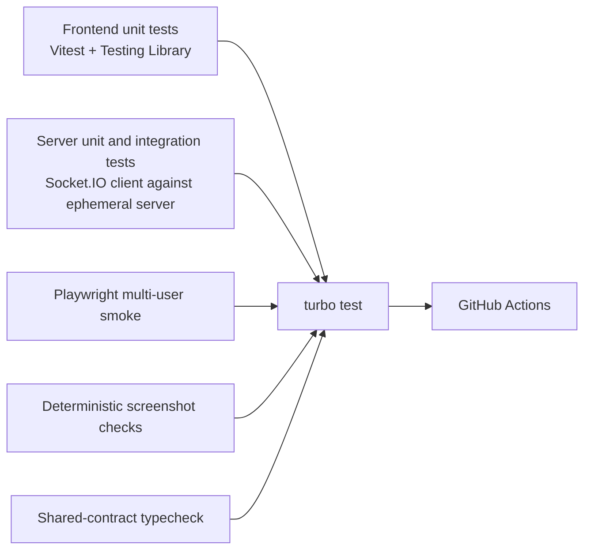

# Planning Poker testing and verification

## Current automated baseline

PP-004 adds focused server integration tests and React transport/session/component tests. PP-005 adds contract-schema tests and the root workspace gate. PP-009 adds deterministic Playwright gallery and visual-baseline checks; the broader CI and browser behavior matrix remains PP-010 scope.

PP-006 adds pure Zustand transition/selector tests, transport listener and acknowledgement tests, reset/privacy checks, and a React selector-isolation test. A real multi-browser convergence smoke remains a manual story check until the deterministic PP-009/PP-010 browser harness exists.

```bash
corepack enable
pnpm install --frozen-lockfile
pnpm lint
pnpm typecheck
pnpm test
pnpm build
```

### Focused package checks

```bash
pnpm turbo run test --filter=@planning-poker/server
pnpm turbo run test --filter=@planning-poker/web
pnpm turbo run test --filter=@planning-poker/contracts
```

### Combined development smoke

```bash
pnpm dev
```

Open `http://localhost:5173` in at least three isolated browser contexts.

## Manual smoke matrix

| ID | Scenario | Expected result |
| --- | --- | --- |
| SM-01 | Load home with backend running | Home actions are available and no connecting card remains |
| SM-02 | Create room and join as first user | A room opens and the first participant is moderator |
| SM-03 | Join from a second browser | Both clients receive the same participant list |
| SM-04 | Attempt duplicate display name | Join is rejected with a readable error |
| SM-05 | Vote from one participant | Others see voted status but not the value before reveal |
| SM-06 | Revoke vote | Vote is removed and any revealed result is hidden |
| SM-07 | All participants vote | Room reveals automatically and both clients agree |
| SM-08 | Moderator reveals early | Submitted values show; non-voters remain identified |
| SM-09 | Reset votes | Every vote clears and cards are enabled again |
| SM-10 | Change each value set | Correct cards appear and previous votes clear |
| SM-11 | Numeric result | Average, minimum, maximum or consensus, and distribution are correct |
| SM-12 | Mixed numeric and special cards | Distribution includes all cards; numeric calculation excludes special cards |
| SM-13 | Delegate moderation | Old moderator loses controls; new moderator gains them |
| SM-14 | Moderator disconnects | The longest-present eligible participant becomes the sole moderator |
| SM-15 | Reconnect moderator identity | A recoverable session returns with the same participant ID and a fresh canonical snapshot without duplicating the name |
| SM-16 | Kick participant | Removed client sees the kicked message and no longer affects room state |
| SM-17 | Copy room ID and link | Clipboard receives the intended value or an actionable failure is shown |
| SM-18 | Narrow viewport | Home, join, room controls, cards, and participants remain usable without horizontal page overflow |
| SM-19 | Backend interruption and restart | UI reports connection loss; recovery behavior matches documented limitations |
| SM-20 | One-hour inactivity cleanup in accelerated test | Clients receive room closure and the room cannot be mutated afterwards |

The focused automated PP-004 suite covers the contract and lifecycle portions of this matrix. Browser smoke evidence must still record the exact browser/container version and three-context result; PP-009 and PP-010 will make that flow deterministic in the release pipeline.

## Release 0.2 automation target



### Minimum automated coverage

- Room creation, join validation, duplicate names, vote/revoke/reveal/reset, value-set change, delegation, removal, leave, disconnect, moderator handoff, and inactivity cleanup.
- Unauthorized moderation attempts and malformed payloads.
- Recoverable and unrecoverable Socket.IO reconnect paths.
- Zustand store actions, selectors, reset behavior, and transport subscription cleanup.
- Responsive home, join, room, result, disconnected, kicked, and closed states.
- Keyboard operation, accessible names, focus visibility, live status announcements, and reduced-motion behavior.
- Turborepo cache inputs/outputs and clean workspace installation.

## Screenshot determinism

Playwright visual output can vary across operating systems, browser versions, fonts, and rendering settings. PP-009 pins Playwright and its container to `1.62.1`, fixes locale, timezone, viewport, color scheme, clock/randomness, animations, fonts readiness, network boundary, and invented fixture data, then compares the real built React UI with the six committed gallery images.

Run `pnpm screenshots:container` for comparison and `pnpm screenshots:update:container` only after explicitly deciding to replace reviewed baselines. On failure, compare the expected PNG in `docs/screenshots/` with Playwright's `*-actual.png` and `*-diff.png` under `apps/screenshots/test-results/`. Inspect all three before changing the expected image; test output is ignored and must not be committed.

See [PP-009](releases/release-0.2-experience-foundation/stories/PP-009-privacy-safe-screenshot-workflow.md) and the [screenshot gallery](screenshots/README.md).

The checks completed for this documentation package and the registry limitation are recorded in the [package verification report](verification.md).

## Evidence template

When a story is implemented, record:

```text
Environment:
- OS/container:
- Node.js/npm:
- Browser/Playwright:

Commands:
- pnpm install --frozen-lockfile
- pnpm lint
- pnpm typecheck
- pnpm test
- pnpm build
- pnpm screenshots

Results:
- lint:
- typecheck:
- unit/integration:
- end-to-end:
- build:
- screenshots reviewed:
- git diff --check:
```
