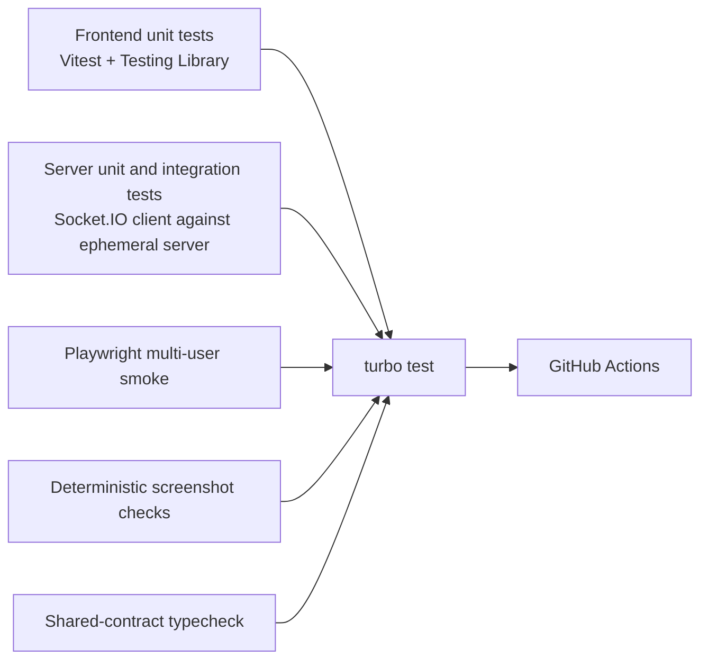

# Planning Poker testing and verification

## Current automated baseline

The supplied project has lint and build scripts but no committed unit, integration, end-to-end, or CI suite. Release 0.1 therefore documents the repeatable baseline without inventing passing tests.

### Frontend

```bash
cd planning-poker-fe
npm ci
npm run lint
npm run build
```

### Backend

```bash
cd planning-poker-be
npm ci
npm run build
```

### Combined development smoke

```bash
cd planning-poker-be
npm run dev-concurrently
```

Open `http://localhost:5173` in at least two isolated browser contexts.

## Manual smoke matrix

| ID | Scenario | Expected result |
| --- | --- | --- |
| SM-01 | Load home with backend running | Home actions are available and no connecting card remains |
| SM-02 | Create room and join as first user | A room opens and the first participant is moderator |
| SM-03 | Join from a second browser | Both clients receive the same participant list |
| SM-04 | Attempt duplicate display name | Join is rejected with a readable error |
| SM-05 | Vote from one participant | Others see voted status but not the value before reveal |
| SM-06 | Revoke vote | Vote is removed and any revealed result is hidden |
| SM-07 | All participants vote | Room reveals automatically and both clients agree |
| SM-08 | Moderator reveals early | Submitted values show; non-voters remain identified |
| SM-09 | Reset votes | Every vote clears and cards are enabled again |
| SM-10 | Change each value set | Correct cards appear and previous votes clear |
| SM-11 | Numeric result | Average, minimum, maximum or consensus, and distribution are correct |
| SM-12 | Mixed numeric and special cards | Distribution includes all cards; numeric calculation excludes special cards |
| SM-13 | Delegate moderation | Old moderator loses controls; new moderator gains them |
| SM-14 | Moderator disconnects | No participant is moderator and takeover is offered |
| SM-15 | Take over moderation | Exactly one current participant becomes moderator |
| SM-16 | Kick participant | Removed client sees the kicked message and no longer affects room state |
| SM-17 | Copy room ID and link | Clipboard receives the intended value or an actionable failure is shown |
| SM-18 | Narrow viewport | Home, join, room controls, cards, and participants remain usable without horizontal page overflow |
| SM-19 | Backend interruption and restart | UI reports connection loss; recovery behavior matches documented limitations |
| SM-20 | One-hour inactivity cleanup in accelerated test | Clients receive room closure and the room cannot be mutated afterwards |

SM-16, SM-18, and SM-19 are expected to expose known issues in the current implementation. They become release gates in Release 0.2 rather than being marked as currently passing.

## Release 0.2 automation target



### Minimum automated coverage

- Room creation, join validation, duplicate names, vote/revoke/reveal/reset, value-set change, delegation, removal, leave, disconnect, moderator handoff, and inactivity cleanup.
- Unauthorized moderation attempts and malformed payloads.
- Recoverable and unrecoverable Socket.IO reconnect paths.
- Zustand store actions, selectors, reset behavior, and transport subscription cleanup.
- Responsive home, join, room, result, disconnected, kicked, and closed states.
- Keyboard operation, accessible names, focus visibility, live status announcements, and reduced-motion behavior.
- Turborepo cache inputs/outputs and clean workspace installation.

## Screenshot determinism

Playwright visual output can vary across operating systems, browser versions, fonts, and rendering settings. Generate and compare the checked screenshots in one pinned container or CI image, with fixed locale, timezone, viewport, color scheme, animations, and invented data. Review every baseline update rather than accepting bulk image changes blindly.

See [PP-009](releases/release-0.2-experience-foundation/stories/PP-009-privacy-safe-screenshot-workflow.md) and the [screenshot gallery](screenshots/README.md).

The checks completed for this documentation package and the registry limitation are recorded in the [package verification report](verification.md).

## Evidence template

When a story is implemented, record:

```text
Environment:
- OS/container:
- Node.js/npm:
- Browser/Playwright:

Commands:
- npm ci
- npm run lint
- npm run typecheck
- npm run test
- npm run build
- npm run screenshots

Results:
- lint:
- typecheck:
- unit/integration:
- end-to-end:
- build:
- screenshots reviewed:
- git diff --check:
```
